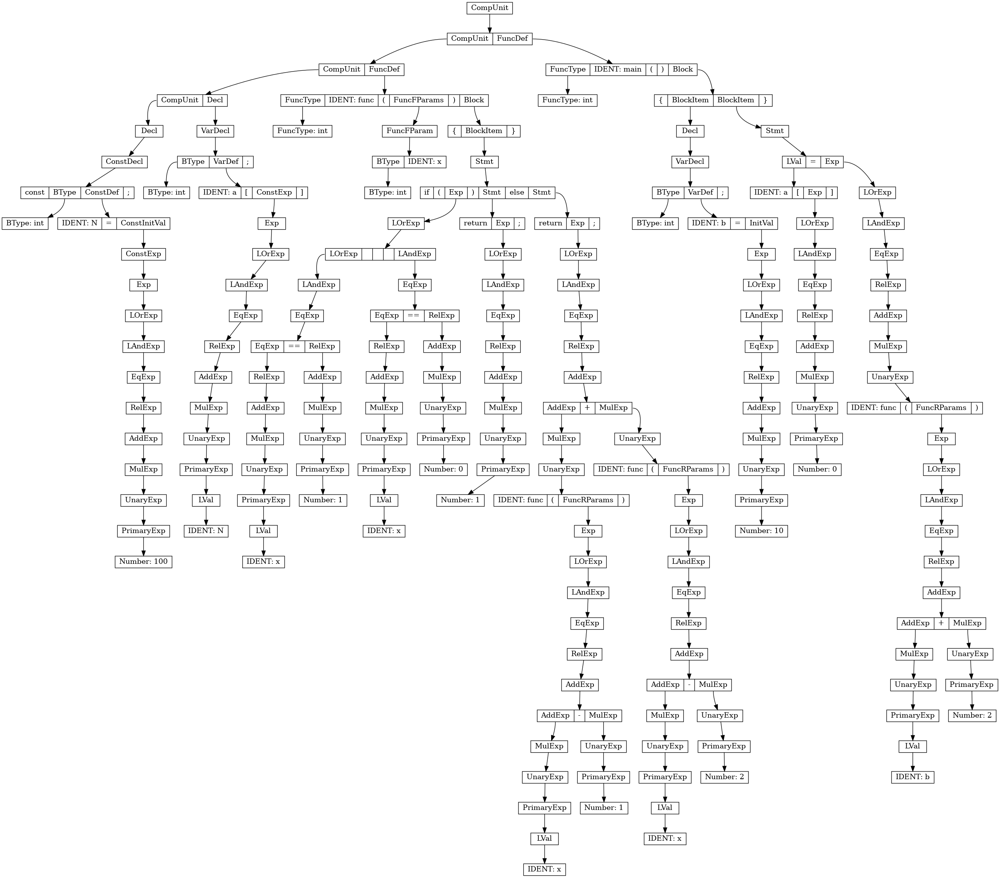

# SysY Compiler 
**latest update: 2024/6/5**

本实验参考北大编译原理实验指导文档：https://pku-minic.github.io/online-doc/#/ ，目前完成了语法分析和AST的构建，使用graphviz工具进行AST的绘制，完成IR和目标代码的生成，分别通过本地测验。


## 1. Run

```bash
# 获取项目文件
git clone https://github.com/xiaobaiv/sysy_compiler.git
# 拉取docker image
docker pull guozhengwu/compiler-dev
# 运行容器，挂载项目文件
docker run -it --rm -v <项目文件> guozhengwu/compiler-dev bash
# 在bash中执行以下命令，得到结果
make
build/compiler -riscv /root/compiler/sysy-make-template/debug/hello.c -o /root/compiler/sysy-make-template/debug/hello.riscv

```

## 2. 编译器使用帮助

这个程序用于编译SysY语言文件，并可以输出Koopa IR或RISC-V汇编代码，同时支持生成抽象语法树（AST）的图像文件。

### 2.1 使用方法

```bash
./compiler [-dot] mode input_file -o output_file
```


#### 2.1.1 参数说明

- `[-dot]` (可选): 如果提供此选项，程序将生成一个表示程序AST的图形文件（PNG格式），保存在`./plot/Tree.png`。
- `mode` : 指定程序的运行模式，可以是 `-koopa` 或 `-riscv` 或 `-perf`。
  - `-koopa` : 将输入的SysY源代码转换成Koopa IR。
  - `-riscv` : 将输入的SysY源代码转换成RISC-V汇编代码。
  - `-perf` : 用于性能测试，通常与 `-riscv` 相同。
- `input_file` : 输入文件路径，应为SysY语言编写的源代码文件。
- `-o output_file` : 指定输出文件的路径。根据 `mode` 的不同，输出文件将是IR或汇编代码。

#### 2.1.2 示例

1. 仅生成Koopa IR，不生成AST图像：
```bash
# 注意compiler的路径，下同
./compiler -koopa example.sy -o example.ir
```
2. 生成RISC-V汇编代码并创建AST图像：
```bash
./compiler -dot -riscv example.sy -o example.s
```
3. 进行性能优化并生成RISC-V：(暂未实现性能优化)
```bash
./compiler -perf example.sy -o performance_result.txt
```

#### 2.1.3 错误处理

- 如果输入文件无法打开，程序会显示错误消息并返回错误代码 `-1`。
- 如果解析输入文件失败，程序同样会显示错误并返回 `-1`。
- 如果输出文件无法创建或写入，程序会显示相应的错误消息并返回 `-1`。

#### 2.1.4 注意

确保在运行程序之前，目录 `./plot/` 已经存在，或者程序有权限创建此目录。否则，生成的AST图像文件将无法保存。


## 3. 测试用例
```c
// Brainfuck Interpreter
// Reads program from stdin, interprets and outputs to stdout.
//
// Main optimization targets:
// jump table, inline variables, etc.
/* 
** 这段代码实现了一个Brainfuck解释器，从标准输入读取Brainfuck程序和输入数据，执行程序并输出结果。
** 解释器通过维护程序、内存带、输入和输出数组来实现Brainfuck的八种命令，并在执行过程中处理循环和输入输出操作。 
*/

int program_length = 0;
int program[65536] = {};
int tape[65536] = {};
int input[65536] = {};
int input_length = 0;
int output[65536] = {};
int output_length = 0;

int get_bf_char() {
  int get = getch();
  while (get != 62 && get != 60 && get != 43 && get != 45 && get != 91 &&
         get != 93 && get != 46 && get != 44 && get != 35) {
    get = getch();
  }
  return get;
}

void read_program() {
  int get = get_bf_char();
  while (get != 35) {
    program[program_length] = get;
    get = get_bf_char();
    program_length = program_length + 1;
  }

  // read input
  // input starts with an `i`
  int verify = getch();
  if (verify != 105) {
    return;
  }
  // and a length
  input_length = getint();
  // and a random char
  getch();
  int i = 0;
  while (i < input_length) {
    input[i] = getch();
    i = i + 1;
  }
}

void run_program() {
  int ip = 0;
  int read_head = 0;
  int input_head = 0;
  int return_address[512] = {};
  int return_address_top = 0;
  output_length = 0;
  while (ip < program_length) {
    int code = program[ip];
    if (code == 62) {
      read_head = read_head + 1;
    } else if (code == 60) {
      read_head = read_head - 1;
    } else if (code == 43) {
      tape[read_head] = tape[read_head] + 1;
    } else if (code == 45) {
      tape[read_head] = tape[read_head] - 1;
    } else if (code == 91) {
      int val = tape[read_head];
      if (val != 0) {
        return_address[return_address_top] = ip;
        return_address_top = return_address_top + 1;
      } else {
        // find the matching ]
        int loop = 1;
        while (loop > 0) {
          ip = ip + 1;
          if (program[ip] == 93) {
            loop = loop - 1;
          }
          if (program[ip] == 91) {
            loop = loop + 1;
          }
        }
      }
    } else if (code == 93) {
      int val = tape[read_head];
      if (val == 0) {
        return_address_top = return_address_top - 1;
      } else {
        ip = return_address[return_address_top - 1];
      }
    } else if (code == 46) {
      output[output_length] = tape[read_head];
      output_length = output_length + 1;
    } else if (code == 44) {
      if (input_head >= input_length) {
        tape[read_head] = 0;
      } else {
        tape[read_head] = input[input_head];
        input_head = input_head + 1;
      }
    }
    ip = ip + 1;
  }
}

void output_() {
  int i = 0;
  while (i < output_length) {
    putch(output[i]);
    i = i + 1;
  }
}

int main() {
  read_program();
  starttime();
  run_program();
  stoptime();
  output_();
  return 0;
}
```
## 4. 输出结果
### 4.1 AST图像


### 4.2 Koopa IR & RISCV 目标代码
见 brainfuck-calculator.koopa 和 brainfuck-calculator.riscv。

## 5. 不足
- 没有进行类型检查等，只工作于正确的代码。
- 只保证功能的正确性，未进行优化，如寄存器的分配、死代码消除、强度削弱等。
- 项目结构不够精简。
希望有时间改进。
